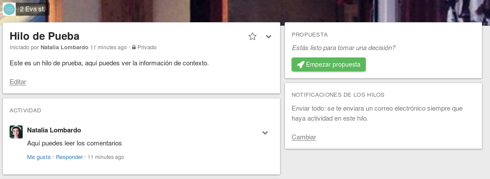

# Hilos de discusión 

En los hilos de una discusión es donde tu grupo puede discutir un tema, intercambiar información y tomar decisiones juntos.

La página del hilo está dividida en tres secciones principales:

1. El panel de **Contexto** contiene el título del hilo, contexto y opciones.

2. La linea de **Actividad** contiene cualquier actualización al hilo. Por ejemplo, si alguien escribe un nuevo comentario o comienza una nueva propuesta, esa actividad se mostrará en esta lista.

3. La sección de la **Propuesta** contiene cualquier propuesta, abierta o cerrada, en ese hilo.

## Comenzar un hilo

Puedes comenzar un nuevo hilo desde cualquier lugar de la app, a través del **Menú de acción** (marcado con el simbolo + en la parte inferior derecha de la pantalla). También hay un botón **Inicia un nuevo hilo** en la página de tu grupo.

El formulario **Inicia un nuevo hilo** te pedirá un **Título** y **Contexto**. El **Título** es un resumen del tema que se discutirá. El **Contexto** es donde puedes compartir cualquier información que los miembros de tu grupo necesiten para poder participar de forma significativa en el hilo. Puedes actualizar el **Contexto** en cualquier momento, esto puede ser una forma útil de resumir una discusión compleja.  

Loomio usa **Markdown** para dar formato a los textos. Puedes usar Markdown in the panel del contexto para dar formato a tu texto o añadir imágenes. Para más información sobre como usar Markdown has clic en el enlace **Ayuda de formato** debajo de la casilla del comentario al pie de la página del hilo para abrir [la guía de Markdown](https://loomio.org/markdown).

## Privacidad del hilo

Si la [configuración de tu grupo](group_settings.html) permite hilos públicos y privados, cuando inicies un nuevo hilo podrás elegir si es público (que se puede buscar públicamente) o privado (solo visible para los miembros del grupo)

## Editar un hilo

Los **Miembros de grupo** pueden editar el título, contexto y privacidad de cualquier hilo que comienzen. Los **Coordinadores de grupo** pueden editar el título, contexto y privacidad de cualquier hilo en el grupo. Los **Coordinadores del grupo** también pueden determinar si los miembros del grupo pueden o no, editar los hilos de otros (ver [configuración del grupo](group_settings.html)).

A la opción **Editar hilo** accedes a través del menú desplegable de opciones del hilo.  
