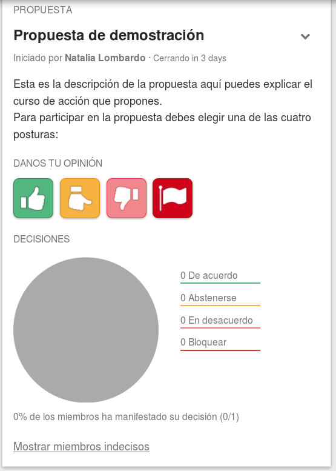

# Propuestas

Las propuestas se llevan a cabo en el [hilo de discusión](discussion_threads.html), que abarca ambos, la discusión y la propuesta. Solo puede haber una propuesta activa a la vez en cada hilo.

## Iniciar una propuesta

Puedes crear una nueva propuesta con el botón **Empezar propuesta** en la página del hilo.

Cuando empiezas una nueva propuesta se te pedirá proveer un **Titulo**, una **Fecha de cierre** y cualquier **Detalle** relevante. Utiliza el campo de **Detalle** para proveer cualquier información que el grupo necesita, para que todos sepan exactamente qué significa estar de acuerdo o no con la propuesta.  

## Editar una propuesta

Solo el autor de la propuesta y el coordinador del grupo pueden editar la misma. El **Titulo** y los **Detalles** de la propuesta solo pueden ser editados hasta que el primer miembro participe. Sin embargo la fecha de **Cierre** puede ser cambiada en cualquier momento.

Para editar la propuesta, selecciona la opción **Editar propuesta** desde el menú desplegable en el panel de la **Propuesta**

## Da tu opinion

Cuando estés lista para participar en una propuesta, puedes seleccionar uno de los cuatro botones: 

* **De acuerdo** significa que estás contenta con la propuesta.

* **Me abstengo** significa que estás contenta con que el grupo decida sin ti.

* **En desacuerdo** significa que tu crees que hay una mejor alternativa, pero estás dispuesta a ir con la decisión del grupo.

* **Bloqueo** significa que tienes serias objeciones y que no serias feliz si la propuesta se lleva a cabo.

Cuando seleccionas tu posición, se te pedirá dar una breve explicación sobre por qué te sientes de esta forma. 

Debajo del gráfico circular habrá una lista de nombres, posiciones y declaraciones sobre la posición, de los miembros que han votado en la propuesta; puedes ver lo que cada persona piensa, haciendo más fácil el estar al día con el hilo. También habrá un enlace **Ver miembros indecisos** donde podras ver una lista de los miembros que no han votado.

## Cambiar tu posición

Si deseas cambiar tu posición puedes hacerlo mediante el enlace **Cambia tu voto** debajo de tu posición en el panel de la **Propuesta**

## Dar el resultado de la propuesta

Cuando una propuesta cierra, se marca en el panel de **Propuestas previas**. puedes ver la propuesta haciendo clic en el enlace **Expandir** en la previsualización de la propuesta. 

Un campo editable de resultado se abrirá bajo el detalle de la propuesta, y la persona que ha iniciado la propuesta será invitada, a través de un correo electrónico, a dar el resultado de la propuesta. El resultado de la propuesta puede ser dado por la persona que ha iniciado la propuesta o por uno de los coordinadores del grupo. 
Cuando el resultado de la propuesta sea enviado, los miembros del grupo serán notificados mediante un correo electrónico.  

## Cerrar una propuesta

Solo el miembro del grupo que ha comenzado la propuesta y la coordinadora, pueden cerrar una propuesta activa. para cerrar una propuesta, selecciona la opción **Cerrar propuesta** desde el menú desplegable de la propuesta. 

## Propuestas cerradas/ propuestas anteriores

Propuestas cerradas son reducidas a una vista previa de la misma y se encuentran en el panel de **Propuestas previas**. Puedes expandir la propuesta haciendo clic en el enlace **Expandir** en la previsualización de la propuesta.
