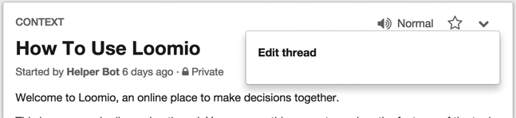

# Discussion threads

Discussion threads are where your group can discuss a topic, exchange information and make decisions together.

The thread page is divided into three main sections:

1. The **Context** panel contains the thread title, context and thread options.

2. The **Activity **feed contains any updates to the thread. For example, if someone posts a new comment, or starts a new proposal, that activity will show up in this list.

3. The **Proposal **section contains any current or closed proposals for that thread.

## Starting a thread

You can start a new thread from anywhere in the app via the **Action Menu**. There is also a **Start a thread **button on the group page.

The **Start new thread** form asks for a **Title** and **Context**. The **Title** is a succinct description of the topic being discussed. The **Context** is where you can share any background information your group members need to participate meaningfully in the thread. You can update the **Context **at any time, which can be a useful way to summarise a complex thread.

Loomio uses **Markdown** for text formatting. You can use Markdown in the context panel to format your discussion context, or to embed images. For more information on how to use Markdown, click the **Formatting help** link underneath the comment box at the bottom of the thread page to open [the Markdown guide](https://loomio.org/markdown).

## Thread privacy

If your [group settings](group_settings.html) allow both public and private threads, when you start a thread you can choose whether it is public (publicly searchable), or private (only visible to members of your group).

## Editing a thread

**Group members** can edit the title, context and privacy of any thread they have started. **Group coordinators** can edit the title, context and privacy of any threads taking in the group. **Group coordinators** can also determine whether or not group members can edit each others’ threads (see [Group settings](group_settings.html)).

The **Edit thread **option is accessed via the thread options dropdown.
