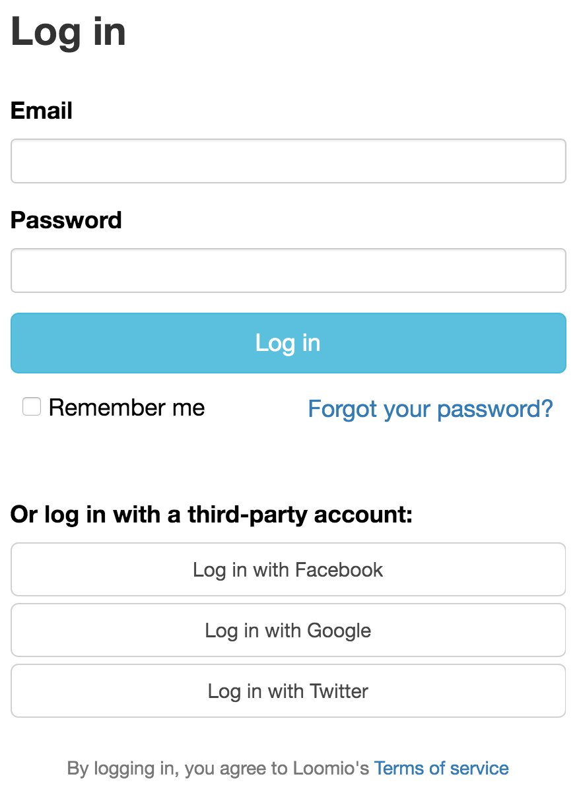

# Getting started

Your introduction to Loomio might happen in a couple of ways. Here’s some information about each entry point:

## Starting a group from the home page

You can start a new group from the Loomio home page by clicking the **Try out Loomio **button. Enter your name, email address and group name into the [**Start a new group**](https://www.loomio.org/start_group) form. You will receive an email containing a link that will take you to your new group.

## You are invited into a Loomio group

When you receive an invitation to join an existing Loomio group, you will receive a unique invitation link by email.

If this is your first time using Loomio you will be prompted to create an account. If you already have a Loomio account you will be taken straight to the group after you log in.

## Single sign-on

Loomio allows sign-up with Facebook, Google, Twitter or Persona. If you do not have a Loomio account you can sign up using any of these third-party services by clicking the corresponding button on the [**Log in** page](http://loomio.org/sign_in). If you are currently logged in to Google, Facebook, Twitter or Persona, we'll link your loomio account to that login method. Otherwise you will be prompted to sign in. When Loomio recognises your existing third-party account, follow the prompts to create your Loomio account.

You may also associate your Google, Facebook, Twitter or Persona account with an existing Loomio account. Ensure you are logged out, visit the [**Log in** page](https://www.loomio.org/users/sign_in) and select your preferred platform. Loomio will ask you if you want to create a new account with your existing account on your chosen platform, or link it to your existing Loomio account.

### Note for Persona users###

Loomio used to support signing in with Mozilla Persona. However, Persona will shortly be [shut down](http://www.pcworld.com/article/3021736/internet/mozilla-persona-login-system-to-shut-down-end-november.html) so we've removed it from Loomio too. To access your account, visit our [password reset page](https://www.loomio.org/users/password/new) and fill in the email address associated with your Persona account.
