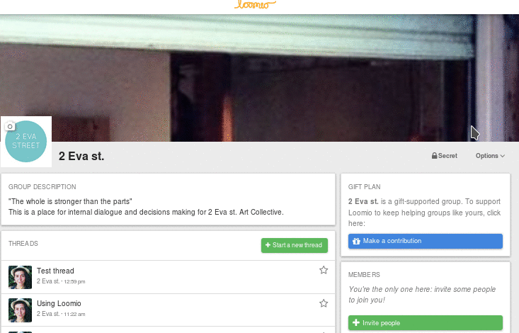

# Group settings

Group coordinators can edit group settings: **Profile**, **Privacy** and **Permissions**.

To edit your group settings, open the **Options** menu on the group page and select **Edit Group Settings**.

## Group profile

Your group profile consists of your group name and group description.

The description gives new members a clear understanding of what that group is for. When adding a group description, describe what your group intends to do, for example, *A public group for us to approve requests for use of the gallery space* or *The space for our board members to consider budget proposals*.

## Group privacy

Your privacy settings determine who can find your group, who can see the threads in your group, and how people join.

When you start a new group, it will be automatically set to **Closed**: threads are only visible to group members, but the group name, description, and members list will be public. This means people can find your group and ask to join it, but the content of your discussions and decisions will stay private.

If you want the content of your discussions and decisions to be public on the web, change your group privacy to **Open**.

If you want to totally hide your group, set your group privacy to **Secret**. This will mean only invited members will be able to see the group name, description, members list, and threads.

Note, if you have a Secret group and change it to Open, all your existing threads will be made public. The same is true in reverse: changing an Open group to Secret will make all your threads private.

## Group permissions – what can members do?

Coordinators set the group permissions to configure what members can do in their group.

### Allow public threads

In **Closed** groups, you can use this option to allow public and private threads in your group. When you start a thread, you can decide whether it is public or private.

### Invite and approve new members

This allows everyone in your group to invite new people in, and approve any membership requests. When it is deselected only group coordinators will be able to invite and approve new members.

### Create sub-groups

This allows everyone in your group to create subgroups. When it is deselected only group coordinators will be able to create subgroups.

### Start threads

This allows everyone in your group to start new threads. When it is deselected only group coordinators will be able to start discussions.

### Edit the context of any thread in the group

This allows everyone in your group to edit the context of any thread. When it is deselected only group coordinators will be able to edit the thread context. (The person who started a thread can always edit the thread context.)

### Edit their comments at any time

This allows everyone in your group to [edit their comments](comments.html#editing-a-comment) at any time. When it is deselected, a comment can only be edited until someone else participates in the thread.

### Raise proposals

This allows anyone in your group to start a proposal within a thread. When this box is deselected only group coordinators will be able to raise proposals.

### Vote on proposals

This allows everyone in your group to state their position on proposals. When it is deselected only group coordinators will be able to state their position on proposals.
