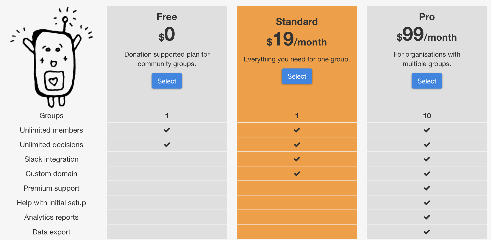

*Prices are in US dollars, plus sales tax where applicable.*

# Frequently asked questions

## Our group has no money! Can we still use Loomio?

Yes. You can choose the Free plan (see our [Pricing](http://loomio.org/pricing "opens pricing page in new tab") page for details).

## We haven't decided which plan suits us yet, can you help?

Just email [contact@loomio.org](mailto:contact@loomio.org "opens in new tab") and we will help chose the right plan for your needs.

## How does the Free plan work?

The Free plan includes all the core functionality of Loomio, with unlimited users. Your members will be occasionally asked for a voluntary donation. Free plans do not include [Premium Features](https://loomio.gitbooks.io/manual/content/en/premium_features.html).

## Do you have prices for annual subscriptions?

Yes. If you choose an annual subscription you get 2 months free! Our annual Standard plan costs US$190, and the Pro plan is US$990.

## What credit cards do you take?

Visa, Mastercard and American Express.

## Are you GST-registered?

Yes we are. In New Zealand GST is added to the price for all paid subscriptions. GST is not added to donations.

## Can I get an invoice?

When you first set up a subscription you will get an email from Chargify, our payment processor, with the subject line **[Loomio] Manage Your Subscription**. That will include a link to log in to your billing portal, which will let you download statements.

