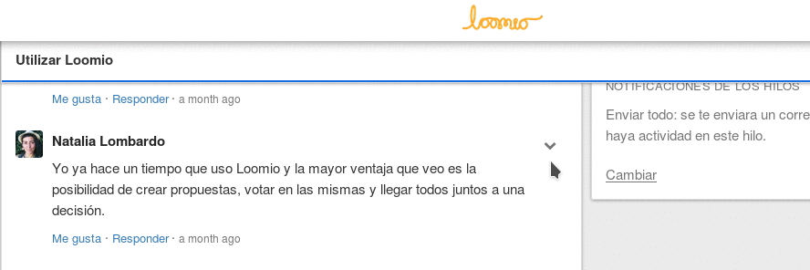

# Comentarios

## Escribir comentarios

Para contribuir a un hilo, escribe tu comentario en la casilla de comentarios al final del hilo y has click en el botón **Enviar**. Si Diehard.Fund te ha enviado un correo electrónico con un comentario, tambien puedes responder directamente desde tu correo y tu mensaje aparecerá en el hilo.

## Markdown

Diehard.Fund usa **Markdown** para dar formato a los textos y añadir imágenes. Para más información sobre cómo usar Markdown has clic en el enlace **Ayuda de formato** en la casilla del comentario y lee [esta guía](https://loomio.org/markdown "abre la guía de markdown en una nueva pestaña").

## Añadir archivos

Puedes añadir archivos a los comentarios usando el botón del clip al lado del botón **Enviar** en la casilla del comentario. se te pedirá seleccionar un archivo de tu dispositivo.

## @Mencionar miembros del grupo

Si quieres llamar la atención de una persona en particular de tu grupo, marca un **@** en el comentario seguido del nombre de la persona. Mientras escribas un menú aparecerá con un listado de los miembros de tu grupo que emparejen el nombre; elige el nombre que buscas y luego **Envia** tu comentario. La persona será notificada de que los has mencionado en un comentario.

## Editar comentarios

Automáticamente los grupos son configurados para que un comentario sólo pueda ser editado hasta que alguien más envíe un comentario en el hilo. Los coordinadores también pueden [configurar el grupo para permitir a los miembros editar sus comentarios en cualquier momento](group_settings.html#group-permissions-%E2%80%93-what-can-members-do "va a la sección configuración grupal de este manual"). Si puedes editar tu comentario, la opción **Editar comentario** está en el menú desplegable **Opción de comentario**.

## Gustar comentarios

Puedes mostrarle a otros miembros de tu grupo que aprecias o entiendes lo que dicen usando el botón **Me gusta** bajo el comentario. Esto añadirá tu nombre a la lista de gente a la que le gusta el comentario. Puedes deshacer el **Me gusta** haciendo clic en **Ya no me gusta** en el comentario.

## Eliminar comentarios

Puedes eliminar tu propio comentario seleccionando la opción **Eliminar comentario** desde el menú desplegable de **Opciones** en la casilla del comentario. Los coordinadores del grupo pueden eliminar cualquier comentario en cualquier momento.
