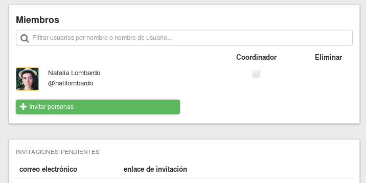

# Coordinando tu grupo

Como coordinador de un grupo de Diehard.Fund, eres responsable de guiar tu grupo a través del proceso de aprender esta nueva pieza de software, asi también como a aprender nuevos procesos para colaborar efectivamente y poder tomar buenas decisiones juntos. Las tares marcadas debajo solo pueden ser llevadas a cabo por los coordinadores de tu grupo.

## Añadir una foto de portada

Cuando entras por primera vez a tu nuevo grupo de Diehard.Fund habrá una imagen de portada seleccionada al azar y un lugar para el logo de tu grupo. Puedes customizar como se ve tu grupo agregando tu propia foto de portada y logo. Puedes subir una nueva foto o logo seleccionando el botón con el icono de una cámara de fotos en el área determinada.

## Manejar membresías

Los coordinadores pueden añadir y remover miembros, y dar o quitar permisos de coordinador. Estas acciones pueden ser realizadas desde la página de **Miembros**, a la que se accede desde el enlace **Administrar miembros**en el menu de **Opciones** en la pagina de tu grupo.

### Añadir/quitar coordinadores

En la página de **Miembros** hay una casilla junto a cada miembro. Cuando esta casilla es seleccionada, el miembro es un coordinador. Al deseleccionar la casilla remueves los permisos de coordinador de ese miembro.

### Añadir/remover miembros

En la página de **Miembros** junto a cada miembro hay un botón **Eliminar** . Este botón remueve al miembro de tu grupo.

### Aceptar/denegar pedidos de membresía

Si tu [configuración de privacidad del grupo](group_settings.html#group-privacy "va a la sección configuración grupal de este manual") le permite a la gente unirse a través de **Pide unirte**, un coordinador tiene que aprobar cada pedido de membresía. Los coordinadores recibirán un correo electrónico cada vez que haya un nuevo pedido de membresía. El enlace en el correo electrónico de notificación te llevará a la página **Pedidos de membresía** donde puedes aceptar o denegar el pedido.   

Si hay un pedido pendiente de membresía también será visible en la página de tu grupo en el panel **Pedidos de membresía**

## Desactivar/archivar tu grupo.

Desactivar tu grupo significa que tu y el resto de los miembros de tu grupo yo no tendrán la posibilidad de acceder a tu grupo. Si deseas desactivar tu grupo puedes hacerlo seleccionando **Desactivar grupo** desde el menú de **Opciones** en la página del grupo. Para reactivar un grupo desactivado contacta el equipo de Diehard.Fund enviando un correo electrónico a [contact@loomio.org](mailto:contact@loomio.org "abre en una nueva pestaña").
