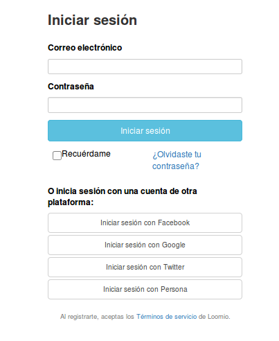

# Comenzar

Tu introducción a Loomio puede suceder de un par de formas diferentes. Aquí hay información sobre cada posible punto de entrada:

## Comenzar un nuevo grupo desde la página principal

Puedes comenzar un nuevo grupo desde la página principal de Loomio seleccionando el botón **Crear un grupo** Entra tu nombre, correo electrónico y nombre del grupo en el formulario [**Crear un grupo**](https://www.loomio.org/start_group "abre en una nueva ventana"). Recibirás un correo electrónico con un enlace que te llevará a la página de tu nuevo grupo.

## Eres invitado a un grupo de Loomio

Cuando seas invitado a unirte a un grupo de Loomio ya existente, recibirás un enlace único por correo electrónico.

Si es tu primera vez utilizando Loomio se te será pedido que crees una cuenta. Si ya tienes una cuenta serás llevado a la página del grupo luego de que ingreses en Loomio.

## Inicia la sesión con cuenta única

Loomio te permite iniciar sesión con tu cuenta de terceros en Facebook, Google, Twitter o Github. Si no tienes una cuenta de Loomio puedes crear una, usando cualquiera de estos otros servicios, al hacer clic en el botón correspondiente en la pagina [**Iniciar sesión**](http://loomio.org/sign_in "abre en una nueva ventana"). Si has iniciado sesión con Google, Facebook, Twitter o Github, enlazaremos tu cuenta de Loomio con ese método de entrada; sino, se te pedirá iniciar una nueva sesión. Cuando Loomio reconozca tu cuenta de terceros, sigue las instrucciones para crear tu cuenta de Loomio.

También puedes asociar tu cuenta de Google, Facebook, Twitter o Github a tu cuenta ya existente de Loomio. Asegurate que has cerrado la sesión, visita la página [**Iniciar sesión**](https://www.loomio.org/users/sign_in "abre en una nueva ventana") y selecciona tu plataforma preferida; Loomio te pedirá si quieres crear una nueva cuenta con tu cuenta ya existente de la otra plataforma o si quieres asociarla con tu cuenta ya existente de Loomio 

 ###Nota para usuarios de Persona###
 
Loomio solía permitir el inicio de sesión con Persona de Mozilla. Pero Persona sera [cerrado](http://www.pcworld.com/article/3021736/internet/mozilla-persona-login-system-to-shut-down-end-november.html "abre articulo en una nueva ventana") a la brevedad, así que sera removido de Loomio también. Para acceder a tu cuenta, visita nuestra página de [cambio de contraseña](https://www.loomio.org/users/password/new "abre en una nueva ventana") y llena los detalles de tu cuenta de email asociada a tu cuenta de Persona.  
