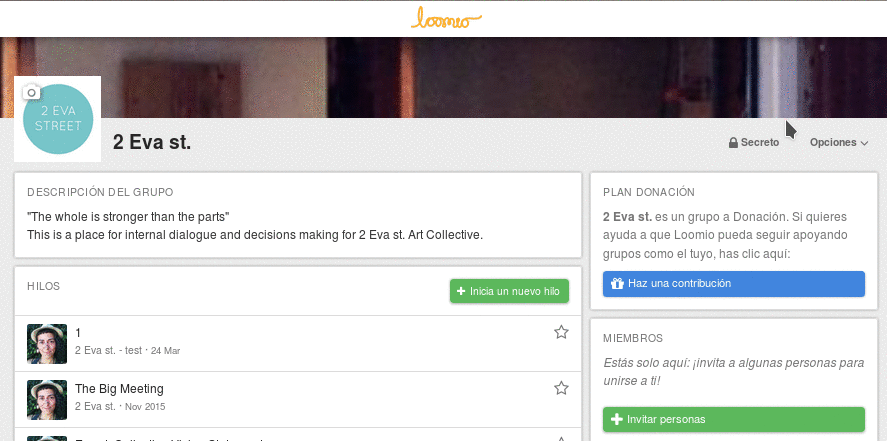
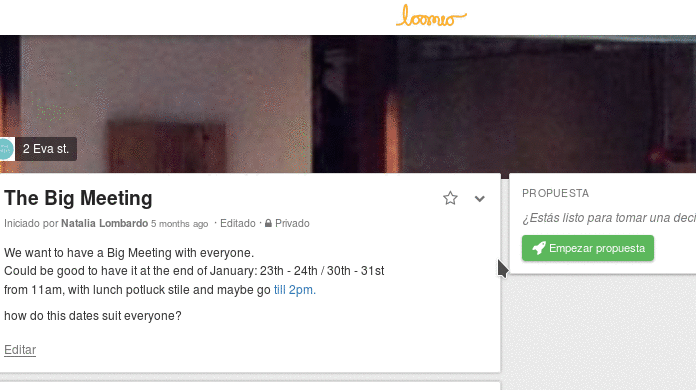
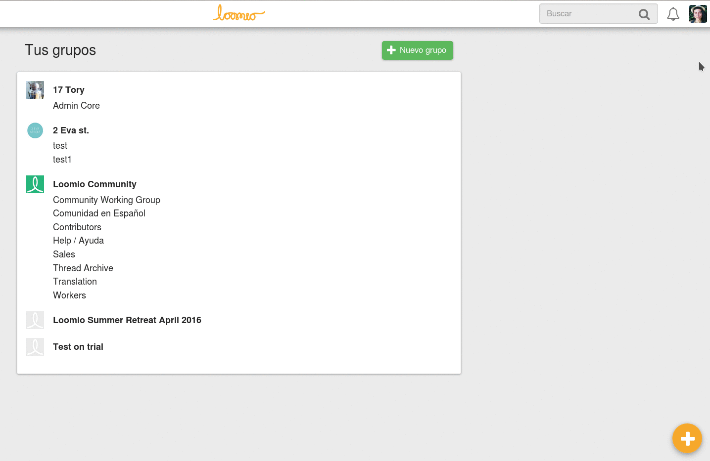

# Estar al día

## Notificaciones

Las notificaciones controlan cuánto correo recibes de un grupo en particular o un hilo de discusión. Hay tres configuraciones para las notificaciones de los grupos y los hilos.

### Notificaciones de los grupos

Para cambiar la configuración actual de las notificaciones de tus grupos abre el menú desplegable de **Opciones** en la página de tu grupo, y selecciona **Ajustes de correo**.

* **Toda la actividad**: Recibirás correo electrónico cada vez que haya actividad nueva (comentarios, votos, hilos nuevos, propuestas, y resultados) en este grupo. **Toda la actividad** es la configuración por defecto para nuevos grupos. Puedes leer sobre como cambiar esta configuración el la sección **Modificar la configuración de correo para todos los grupos**.

* **Actividad importante**: Recibirás correo electrónico sobre nuevos hilos y propuestas (ej. cuando una propuesta es iniciada, a punto de cerrar, o cuando se cree un resultado en la misma).

* **No enviar correo**: No recibirás correo electrónico sobre actividad en este grupo, pero veras la nueva actividad en tu página [**No leído**](reading_loomio.html#unread-threads) y en Recientes.

Para aplicar una configuración particular a todos tus grupos, selecciona la casilla **Aplicar esta configuración para todos mis grupos** antes de enviar el formulario.

### Ajustes de notificación de los hilos

Cuando inicias un nuevo hilo, recibirá la misma configuración de notificaciones que el grupo al que pertenece. Puedes cambiar la configuración de las notificaciones del hilo seleccionando **Ajustes de correo** en el menú desplegable de opciones en el contexto del hilo.

* **Toda la actividad**: Recibirás correo electrónico cada vez que haya actividad nueva (comentarios, votos, hilos nuevos, propuestas, y resultados) en este hilo.

* **Actividad importante**: Recibirás correo electrónico cuando una propuesta es iniciada, a punto de cerrar, o cuando se cree un resultado en la misma.

* **No enviar correo**: No recibirás correo electrónico sobre este hilo.
Para aplicar una configuración particular a todos tus grupos, selecciona la casilla **Aplicar esta configuración para todos los hilos de este grupo** antes de enviar el formulario.

## Ajustar la configuración para todos los grupos

Hay tres configuraciones adicionales que pueden ser aplicada para todos los grupos.

**Ayer en Loomio**: Seleccionar este ajuste significa que cada mañana recibirás un correo con la actividad que no has leído el día anterior. Este email te provee con una rutina fácil de seguir para estar al día con la actividad en Loomio.

**Suscribirte a la participación**: Esta opción significa que cuando participes en un hilo, recibirás toda la información siguiente.

**Menciones**: Significa que cuando alguien quiera llamar tu atención , pueden @mencionar tu nombre en un comentario y serás notificado. Recomendamos dejar esta opción seleccionada.

Estas opciones pueden ser configuradas desde tu página de **Configuración de correo electrónico**. Para acceder a esta página, selecciona la opción **Configuración de correo electrónico** en tu menú de usuario.

## Ajuste predeterminado para nuevos grupos

Bajo el subtítulo **Configuración para grupos especifico** en la sección **Ajustes de correo** en tu menú de usuario, puedes ver la configuración de correo determinada para cada nuevo grupo en el que participes. Para cambiarlo selecciona **Cambiar configuración predeterminada**.

## Silenciar hilos

Silenciar hilos significa que no serás notificado sobre propuestas, o ninguna otra actividad en ese hilo, a no ser que alguien te @mencione.

Puedes silenciar un hilo desde la vista previa del mismo que se muestra en la pagina de tu grupo, y las páginas de Hilos Recientes y No leídos. Pasa el ratón por encima y seleccionando la opción **Silenciar**.

Los hilos silenciados no son visibles en la página Recientes y No leído. Para ver tus hilos silenciados, ve a la página Recientes y selecciona "Silenciado" desde el menú "Filtrar hilos".

## Marcar como leído

Puedes marcar hilos como leídos desde la vista previa de los mismos en la página de tu grupo, Recientes y No leído. Para hacerlo, selecciona la opción **Marcar como leído** indicada con un tilde. Marcando un hilo como leído lo removerá de tu página [**No leído**](reading_loomio.html#unread-threads).

## Responder por correo

Puedes responder a cualquier comentario vía correo electrónico y tu respuesta aparecerá en en hilo de Loomio. También puedes elegir ver el comentario en el contexto del hilo en Loomio haciendo clic en el enlace **Leer en www.Loomio.org** al pie del correo electrónico.
