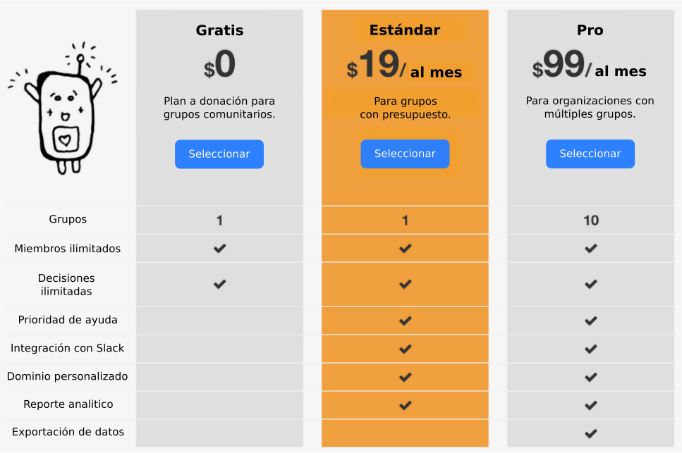

# Preguntas frecuentes sobre de los planes de pago

## Nuestro grupo no tiene dinero! ¿Podemos utilizar Loomio de todas formas?

Si. Pueden elegir el Plan Gratis (lee nuestra página [Planes de pago](http://loomio.org/pricing)

## No puedo decidir que plan elegir ¿Puedes ayudarme?

Si. Solo contactanos a [contact@loomio.org](mailto:contact@loomio.org) y te ayudaremos a elegir que plan se ajusta mejor a las necesidades de tu grupo.

## ¿Cómo funciona el Plan Gratis?

Si tu grupo elige el Plan Gratis, ocasionalmente les pediremos a los miembros del grupo por una donación voluntaria. 

## ¿Tienen precios por suscripciones anuales?

Si. Nuestro plan Estándar cuesta US$190 al año y el plan Plus es US$990 por año.

## ¿Cómo funciona la integración con Slack?

A través de la integración con Slack, cuando haya actividad importante en tu grupo de Loomio (Una nueva discusión o propuesta), aparecerá también en el canal de Slack que tu elijas. Y la gente podrá votar directamente desde Slack seleccionando una de las posiciones. Nota: Esta integración solo esta disponible para suscripciones pagas (Estándar o Plus)  

## ¿Que tarjeta de crédito aceptan?

Visa, Mastercard y American Express.

## ¿Están registrados como GST?

En Nueva Zelanda el impuesto de GST es agregado al precio de toda suscripción. GST no es agregado a las donaciones. 

## ¿Puedo tener un recibo?

Cuando eliges una suscripción por primera vez recibirás un correo electrónico de Chargify, nuestro procesador de pago, con el título **[Loomio] Administra tu Suscripción***. Este correo incluirá un enlace para iniciar sesión en tu portal de facturación, desde donde podrás descargar el resumen de cuenta.  
