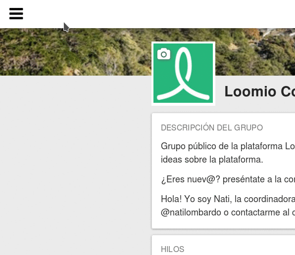

# Navegando Loomio

Puedes acceder a las partes más importantes de Loomio a través de la barra lateral de navegación en la parte izquierda de la pantalla. La misma está abierta por defecto en pantallas grandes, y cerrada en pantallas pequeñas (como los teléfonos móbil). Puedes abrirla o cerrarla con el icono de barras en la esquina superior derecha de la pantalla. 

## Ver tus hilos

### Hilos recientes

Te da un resumen de las actividades más recientes. Puedes acceder a esta página seleccionando **Reciente** en la barra lateral.
Si eres miembro de varios grupos ésta página será tu página de inicio cuando entras en Loomio.

Veras tus hilos en una lista priorizada. Propuestas abiertas en la parte superior, seguidas de los hilos **Favoritos**, luego todos los hilos de tus grupos, con los más recientes primero, **Hoy**, **Ayer**, **Este mes**, **Más de un mes**.

Si el título en un hilo o propuesta está en **Negrita** entonces significa que ha habido nueva actividad desde la última vez que entraste, números entre paréntesis marcan la cantidad de nuevos comentarios o votos desde la ultima vez que viste el hilo. Las propuestas te mostraran un gráfico circular, con el símbolo de tu posición sobreimpreso. Si aún no has votado, mostrará un signo de interrogación.

### Hilo favoritos (con estrella)

Haciendo clic en el símbolo de estrella en la vista previa del hilo lo marca como favorito. Utiliza las estrellas para marcar ciertos hilos como importantes. Solo tu podrás ver qué hilos son tus favoritos.

### No leído

Esta página te muestra todos los hilos y propuestas que tienen nuevo contenido desde la última vez que has entrado. Puedes hacer clic en **Marcar como leído** en la vista previa del hilo para eliminarlo de esta lista sin necesidad de visitar la página del mismo. Accede a esta página seleccionando **No leído** en la barra lateral.

### Silenciado

La página **Silenciados** te muestra todos los hilos que haz silenciado previamente. Accedes desde la barra lateral seleccionando Silenciados. Los hilos silenciados no aparecerán en tus páginas **Recientes** o **No leídos**. Puedes silenciar un hilo pasando el mouse por encima de la vista previa y seleccionando la opción de silenciar. 

## Filtrar hilos

El menú desplegable de **Filtrar hilos** en la página de Recientes, te permite elegir ver:

* **Hilos recientes:** todos los hilos y propuestas con actividad reciente.

* **Hilos participativos**:  solo los hilos y propuestas en los que has participado.

* **Silenciado: ** solo los hilos que has [silenciado](keeping_up_to_date.html#thread-volume) previamente.

## Ver tus grupos

Todos los grupos a los que pertenecen están listados en la barra lateral. Si solo eres miembro de un grupo de Loomio, la página de ese grupo será tu página principal. Si tienes múltiples grupos puedes navegar a través de ellos fácilmente desde la barra lateral.

## Explorar grupos públicos

Puedes buscar y pedir membresía a grupos públicos en Loomio visitando la página **Explorar grupos públicos**. Accede a esta página desde la barra lateral

## Editar tu información personal

Puedes ver y actualizar tu perfil seleccionando la opción Editar Perfil en la barra lateral. Puedes leer más información sobre como actualizar tu Perfil en la sección **[tu perfil de usuario](https://loomio.gitbooks.io/manual/content/en/your_user_profile.html)**.

Puedes actualizar tus preferencias de correo desde la opción Ajustes de correo en la barra lateral. Puedes leer más información al respecto en la sección **[Estar al día](https://loomio.gitbooks.io/manual/content/en/keeping_up_to_date.html)**.
 
