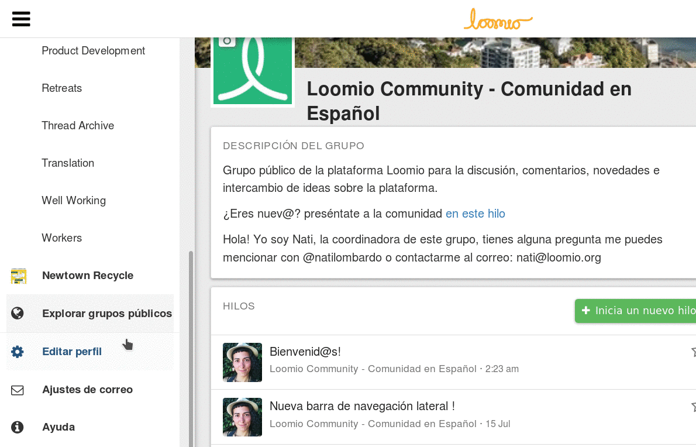

# Tu perfil de usuario

Tu página de perfil te deja personalizar tu identidad en Loomio. Para visitar tu perfil selecciona **Editar Perfil*** desde la barra de navegación lateral.

## Actualizar tu configuración personal
Puedes actualizar el nombre, usuario, dirección de correo electrónico y lenguaje asociados con tu cuenta, editando el campo correspondiente en tu página de perfil y haciendo clic en **Actualizar perfil**.

## Añade una foto de perfil
Cuando crea tu cuenta en Loomio por primera vez, tus iniciales serán la imagen por defecto asociada con tu perfil. Puedes añadir una foto de perfil haciendo click en **Cambiar imagen** bajo tu foto en la página de tu perfil. Si tienes un [Gravatar](https://en.gravatar.com/ "abre en una nueva pestaña") puedes configurarlo como tu foto de perfil, para esto selecciona **Usar Gravatar**

## Configuración de lenguaje
Loomio está disponible en varios lenguajes. Detectará automáticamente la configuración de  lenguaje de tu navegador, o puedes configurarlo automáticamente visitando tu [página de perfil](#your-user-profile) y seleccionando tu lenguaje del menú desplegable de **Lenguaje**

## Nombre de usuario
Tu nombre de usuario es el nombre que la gente utilizara para ([@mencionarte](comments.html#-mentioning-group-members "va a la sección comentarios de este manual")) en comentarios; puedes cambiarlo editando el campo **Nombre de usuario** en tu [página de perfil](#your-user-profile) y haciendo clic en **Actualizar perfil**.

## Cambiar tu contraseña
Si has iniciado sesión en Loomio puedes cambiar tu contraseña visitando tu página de perfil y haciendo clic en **Cambiar tu contraseña**. Si no has iniciado sesión puedes visitar la página [**¿Olvidaste la contraseña?**](https://www.loomio.org/users/password/new "abre en una nueva pestaña")

## Desactivar tu cuenta
Si no eres el único coordinador de algún grupo puedes desactivar tu cuenta visitando tu [página de perfil](#your-user-profile) y haciendo clic en **Desactivar cuenta**. Si eres el único coordinador de un grupo, no podrás desactivar tu cuenta hasta que hayas apuntado a otro miembro como el coordinador o archivado el grupo.

Una vez que tu cuenta ha sido desactivada:

* Ya no serás listado como miembro de ningún grupo.
* Comentarios, propuestas y discusiones en las que has formado parte, permanecerán pero tu nombre será removido.
* Ya no recibirás correo electrónico relacionado con Loomio.
* Necesitarás [contactarnos](https://loomio.org/contact "abre en una nueva pestaña") para reactivar tu cuenta.

## Reactivar tu cuenta
Para reactivar una cuenta desactivada [contacta al equipo de Loomio](https://loomio.org/contact "abre en una nueva pestaña").

## Dejar un grupo

Si no eres el único coordinador de un grupo, puedes dejarlo haciendo clic en **Dejar el grupo** desde el menú de opciones en la página del grupo. Si eres el único coordinador del grupo, no se te permitirá dejarlo hasta que no hayas apuntado a un nuevo coordinador o desactivado tu grupo.
