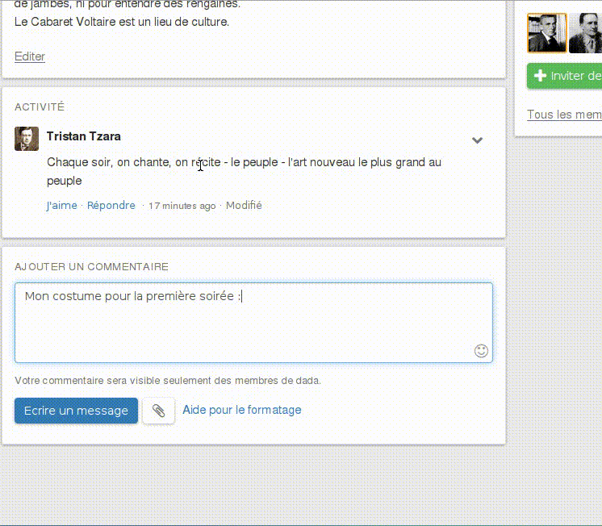
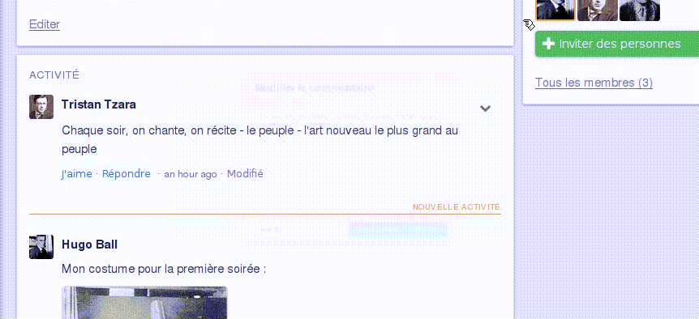

# Commentaires

## Écrire des commentaires

Afin de contribuer à un fil, inscrivez votre commentaire dans le formulaire de commentaire à la fin du fil et cliquez sur le bouton **Écrire un message**. Si Loomio vous a envoyé un email avec un commentaire, vous pouvez également y répondre directement et votre message apparaîtra dans le fil de discussion.

## Markdown

Loomio utilise le langage **Markdown** pour vous permettre de mettre en forme votre texte ou d‎’y inclure des images. Pour plus d‎’informations sur la façon d‎’utiliser Markdown, allez lire [ce guide](https://www.loomio.org/markdown).

## Pièces jointes

Vous pouvez joindre des fichiers aux commentaires en utilisant le bouton des pièces jointes près du bouton **Écrire un message** sur le formulaire de commentaire. Il vous sera alors demandé de choisir un fichier de votre appareil.

## @mentionner des membres du groupe

Si vous voulez attirer l‎’attention de personnes spécifiques de votre groupe, entrez **@** dans le champ commentaire suivi de leur nom. Lors de la saisie du nom, un menu apparaîtra, listant les membres de votre groupe qui correspondent à ce nom. Sélectionnez le membre que vous souhaitez, puis **Écrire un message** pour envoyer votre commentaire. Ils seront prévenus que vous les avez mentionnés dans un commentaire.

## Modifier des commentaires

Dans la configuration par défaut des groupes, un commentaire peut être modifié uniquement si aucun nouveau commentaire n‎’a été saisi. Les coordinateurs de groupe peuvent également [configurer les groupes pour autoriser les utilisateurs à modifier leurs commentaires à n‎’importe quel moment](group_settings.html#group-permissions-–-what-can-members-do). Si vous pouvez modifier votre commentaire, l‎’option **Modifier le commentaire** se trouve dans le menu déroulant des **Options de commentaire**.

## Aimer des commentaires

Vous pouvez montrer que vous appréciez ou que vous comprenez ce que dit un autre membre du groupe en utilisant le bouton **Aimer** sous le commentaire. Cela ajoutera votre nom à la liste des personnes qui ont aimé ce commentaire. Vous pouvez également annuler l‎’action **Aimer** en cliquant sur **Ne plus aimer** sur le commentaire.

## Supprimer les commentaires

Vous pouvez supprimer vos propres commentaires en sélectionnant **Supprimer le commentaire** dans le menu déroulant **Options du commentaire**. Les coordinateurs de groupe peuvent supprimer n‎’importe quel commentaire de ce groupe.
