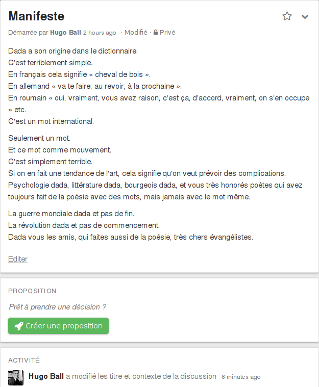
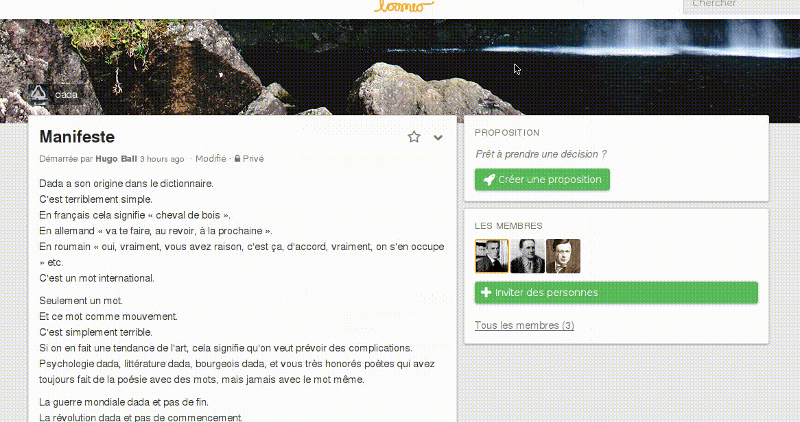

# Fils de discussion

Les fils de discussion sont l‎’endroit où votre groupe peut débattre d‎’un sujet, échanger des informations et prendre des décisions ensemble.

La page des fils de discussion est constituée de trois sections principales&nbsp;:

1. La partie **Contexte** contient le titre du fil de discussion, son contexte ainsi que ses options.

2. La partie **Activité** contient les mises à jour du fil de discussion. Par exemple, si quelqu‎’un publie un nouveau commentaire, ou commence une nouvelle proposition, cette activité va apparaître dans la liste.

3. La section **Propositions** contient toutes les propositions en cours ou fermées pour le fil de discussion.

## Commencer un fil de discussion

Vous pouvez commencer un nouveau fil de discussion depuis n‎’importe où dans l‎’application via le **Menu Action**. Il y a aussi un bouton **Commencer un fil de discussion** sur la page du groupe.

Le formulaire **Commencer un fil de discussion** requiert un **Titre** et un **Contexte**. Le **Titre** est une description succincte du sujet à discuter. Le **Contexte** est fait pour partager les informations sur le sujet du fil afin de permettre aux membres de votre groupe d‎’y participer pleinement. Vous pouvez mettre à jour le **Contexte** à tout moment, ce qui peut être un manière utile de résumer un fil de discussion complexe.

Loomio utilise le **Markdown** pour la mise en page de texte. Vous pouvez utiliser le Markdown dans la partie contextuelle pour mettre en page le contexte de votre discussion, ou pour mettre une image. Pour plus d‎’informations sur l‎’utilisation du Markdown, cliquez sur le lien **Aide pour la mise en page** en dessous des commentaires en bas de la page des fils de discussion pour ouvrir [le guide Markdown](https://loomio.org/markdown).

## Fils privés

Si vos [paramètres de groupe](group_settings.html) permettent aussi bien les fils publics que privés, lorsque vous démarrez un fil, vous pouvez choisir s’il est public (publiquement accessible y compris pour la recherche), ou privé (seulement visible pour les membres de votre groupe).

## Éditer un fil

**Les membres du groupe** peuvent modifier le titre, le contexte et le caractère privé de n‎’importe quel fil qu‎’ils ont commencé. **Les coordinateurs du groupe** peuvent modifier le titre, le contexte et le caractère privé de n‎’importe quel fil du groupe. **Les coordinateurs du groupe** peuvent également décider quels membres peuvent modifier les fils des autres membres ou non (cf [Paramètres de groupe](group_settings.html)).
L‎’option **Éditer le fil** est accessible via le menu déroulant des options de fil de discussion.

Via the thread Options dropdown menu you can also **delete, print, move, mute** or change the **email settings** for that thread.

