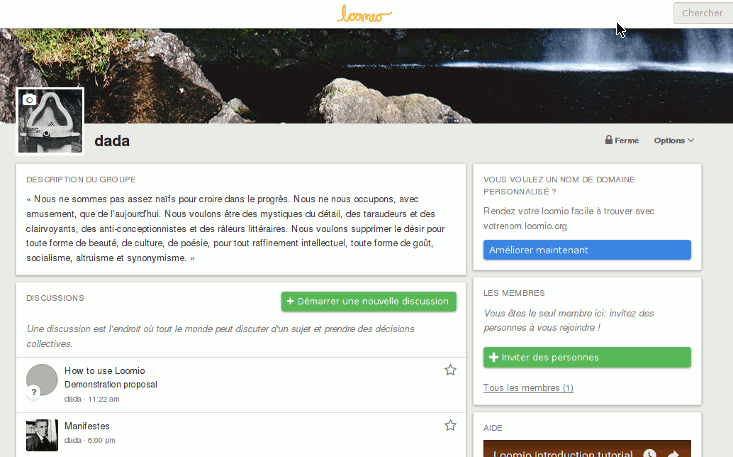
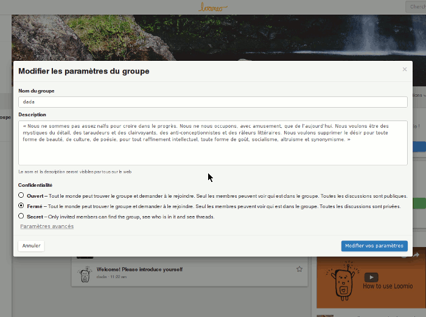

# Paramètres de groupe

Les coordinateurs de groupe peuvent éditer les paramètres de groupe&nbsp;: **Profil**, **Visibilité** et **Permissions**.

Pour changer vos paramètres de groupe, ouvrez le menu **Options** sur la page du groupe et sélectionnez **Changer les paramètres du groupe**.

## Profil de groupe

Votre profil de groupe est constitué de votre nom de groupe et de la description de votre groupe.

La description donne aux nouveaux membres une compréhension claire de ce qu‎‎’est le groupe. Quand vous ajoutez une description de groupe, décrivez ce que votre groupe compte faire, par exemple, *Un groupe public pour que nous puissions approuver les demandes d‎‎’utilisation de la galerie* ou *L‎‎’espace pour les membres de notre conseil afin de considérer les propositions de budget*.

## Visibilité du groupe

Vos options de visibilité déterminent qui peut trouver votre groupe, qui peut voir les fils de discussion dans votre groupe et comment les gens peuvent le rejoindre.

Lorsque vous créez un nouveau groupe, il sera automatiquement **Fermé**&nbsp;: *les fils et la liste des membres ne seront visibles qu’aux membres du groupe, mais le nom du groupe et sa description seront publics.* Cela signifie que des gens peuvent trouver votre groupe et demander à le rejoindre, mais que le contenu de vos discussions et vos décisions resteront privés à moins d’accepter des fils publics (expliqué dans la section **Permisson de goupe**).

Si vous souhaitez que le contenu de vos discussions et de vos décisions soient publics sur le web, changez la visibilité de votre groupe à **Ouvert**. La liste des membres ne sera visible qu’aux autres membres.

Si vous souhaitez totalement cacher votre groupe, changez la visibilité à **Secret**. Cela signifie que seuls les membres invités seront en mesure de voir le nom du groupe, sa description, la liste des membres et ses fils de discussion.

Notez que si vous changez la visibilité d’un groupe **Secret** à **Ouvert**, tous les fils existants deviendront publics. Cela s’applique aussi au cas inverse&nbsp;: changer un groupe d’**Ouvert** à **Secret** rendra tous ses fils privés.

## Droits du groupe – Que peuvent faire les membres&nbsp;?

Les coordinateurs règlent les droits du groupe pour configurer ce que les membres du groupe peuvent faire.

### Autoriser des fils de discussion publics

Dans les groupes **Fermé**, vous pouvez utiliser cette option pour autoriser des fils de discussions à la fois privés et publics dans votre groupe. Quand vous commencez un fil de discussion, vous pouvez décider de le rendre public ou privé.

### Inviter et approuver de nouveaux membres

Cette option permet à tous les membres d‎‎’inviter de nouvelles personnes dans le groupe, et d‎‎’accepter n‎‎’importe quelle demande d‎‎’appartenance. Quand elle est désactivée, seuls les coordinateurs du groupe sont capables d‎‎’inviter et d‎‎’accepter de nouveaux membres.

### Créer des sous-groupes

Cette option permet à tous les membres de créer des sous-groupes. Quand elle est désactivée, seuls les coordinateurs du groupe sont capable de créer des sous-groupes.

### Démarrer un fil de discussion

Cette option permet à tous les membres de commencer un nouveau fil de discussion. Quand elle est désactivée, seuls les coordinateurs du groupe peuvent commencer de nouveaux fils de discussion.

### Éditer le contexte de n‎‎’importe quel fil de discussion du groupe

Cela permet à chaque membre du groupe d‎‎’éditer le contexte de n‎‎’importe quel fil de discussion. Quand elle est désactivée, seuls les coordinateurs du groupe peuvent éditer le contexte du fil de discussion (la personne qui a commencé un fil de discussion peut toujours éditer le contexte du fil).

### Éditer ses commentaires à tout moment

Cette option permet à tous les membres d‎‎’[éditer leurs commentaires](comments.html#editing-a-comment). Quand elle est désactivée, un commentaire peut être édité seulement jusqu‎‎’à ce que quelqu‎‎’un participe au fil de discussion.

### Soumettre une proposition

Cette option permet à tous les membres de soumettre une proposition à l‎‎’intérieur d‎‎’un fil de discussion. Quand cette case n‎‎’est pas sélectionnée, seuls les coordinateurs du groupe peuvent soumettre de nouvelles propositions.

### Voter sur les propositions

Cette option permet à tous les membres de se positionner par rapport à une proposition. Quand elle est désactivée, seul les coordinateurs du groupe peuvent se positionner par rapport aux propositions.
