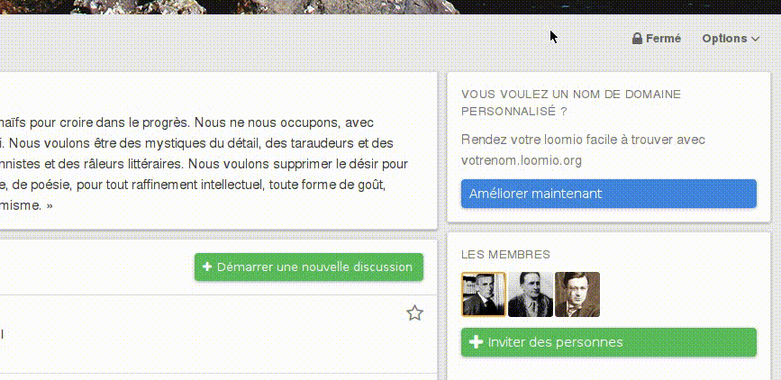
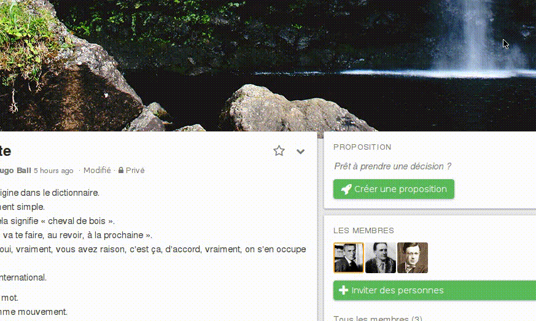
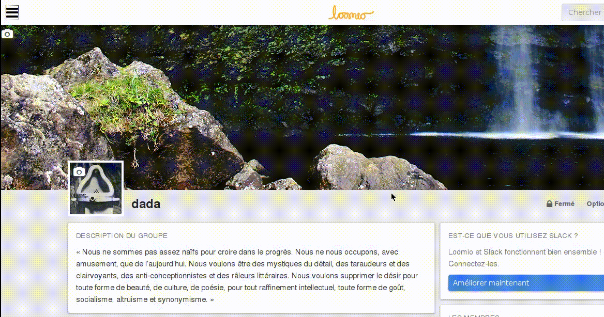

# Se tenir à jour

## Paramètres des courriels

Les paramètres de vos e-mails contrôlent la fréquence à laquelle vous entendez parler d‎‎’un groupe ou d‎‎’un fil de discussion spécifique. Il y a trois paramètres pour chaque groupe et fil.

Vos paramètres de courriels vous permettent de définir la fréquence à laquelle vous avez des nouvelles d‎‎’un groupe ou d‎‎’un fil de discussion particulier. Il existe trois paramètres valables à la fois pour les groupes et les fils de discussion.

### Paramètres de la messagerie pour les groupes

Pour modifier vos paramètres de courriel de groupe, affichez le menu déroulant **Options**, faites défiler et sélectionnez **Paramètres de courriel**.

* **Toute activité**&nbsp;: vous recevrez un courriel à chaque fois qu‎‎’il y a de l‎‎’activité (commentaires, votes, nouveaux fils, propositions, et résultats de proposition) dans ce groupe. **Toute activité** est le paramètre par défaut pour les nouveaux groupes. La section **Mettre à jour les paramètres de courriel pour tous les groupes** explique comment modifier les paramètres de courriel par défaut pour les nouveaux groupes.

* **Activité importante**&nbsp;: vous recevrez un courriel au sujet des nouveaux fils et propositions (c‎‎’est-à-dire lorsqu‎‎’une proposition est créée, s‎‎’apprête à fermer ou quand un résultat est créé pour une proposition).

*  **Aucun courriel**&nbsp;: vous ne recevrez aucun courriel portant sur l‎‎’activité dans ce groupe, mais vous pourrez voir les dernières mises à jour sur les pages [**Non lues**]((#reading_loomio.html#unread-threads) et la page **Récent**.

Pour appliquer les mêmes paramètres à l‎‎’ensemble de vos groupes, cochez la case **Appliquer ces paramètres à tous mes groupes** avant d‎‎’envoyer le formulaire.

### Paramètres de la messagerie d‎‎’un fil de discussion

Lorsque vous commencez un nouveau fil de discussion, il hérite des paramètres de courriel par défaut attribués par son groupe. Pour modifier les paramètres de courriel, ouvrez le menu déroulant des options du fil et sélectionnez dans ce menu **Paramètres de courriel**.

* **Toute activité**&nbsp;: vous recevrez un courriel à chaque fois qu‎‎’il y a de l‎‎’activité (commentaires, nouvelles propositions, votes et résultats d‎‎’une proposition) dans ce fil.

* **Activité importante**&nbsp;: vous recevrez un courriel lorsqu‎‎’une proposition est créée, s‎‎’apprête à fermer ou lorsqu‎‎’un résultat est créé.

* **Aucun courriel**&nbsp;: vous ne recevrez aucun courriel au sujet de ce fil.

Pour que les mêmes paramètres soient définis pour l‎‎’ensemble de vos fils de discussion, cochez la case **Appliquer ces paramètres à tous les fils de discussion dans ce groupe** avant d‎‎’envoyer le formulaire.

If you have muted a thread you won't be notified about proposals, or any other activity taking place in the thread, unless someone @mentions you. You can read more about muting threads under the **Muted** subheading in the **Navigating Loomio** section of the help documentation.

### Mettre à jour les paramètres de messagerie pour tous les groupes

Il y a trois paramètres de messagerie électronique supplémentaires qui peuvent être appliquées à tous les groupes.

**Messagerie, résumé quotidien**&nbsp;: l‎‎’activation de ce paramètre signifie que tous les matins vous recevrez un courriel résumant toutes les activités que vous avez manquées la veille. Cette messagerie fournit une routine simple pour rester à jour avec les activités Loomio.

**S‎‎’abonner…**&nbsp;: activer ce réglage signifie que, lorsque vous participez à un fil de discussion, toute nouvelle activité vous sera immédiatement envoyée par courriel.

**Avertir quand je suis mentionné**&nbsp;: activer ce réglage signifie que lorsque quelqu‎‎’un veut attirer votre attention il peut mentionner votre @nom dans un commentaire qui vous sera notifié. Nous recommandons de toujours activer ce paramètre, afin d‎‎’être informé par courriel dans ce cas.

Ces paramètres peuvent être configurés à partir des **paramètres de courriel** de la page utilisateur, qui est accessible par le menu **paramètres de courriel** dans le menu utilisateur.

### Paramètres par défaut des nouveaux groupes

Sous l‎‎’en-tête **Paramètres d‎‎’un groupe particulier** sur la page ** Paramètres de courriel** vous pouvez lire les paramètres de courriel par défaut pour les nouveaux groupes. Afin de modifier les paramètres de courriel par défaut pour tous les nouveaux groupes que vous rejoignez, cliquez sur le lien **Changer les paramètres par défaut** et sélectionnez les nouveaux paramètres par défaut.

### Replying by email

You can reply to any comments you receive directly via email and your replies will be posted in the Loomio thread. You can also choose to view the comment in the context of the thread on Loomio by clicking the **view it on www.loomio.org** link in the footer of the email.
