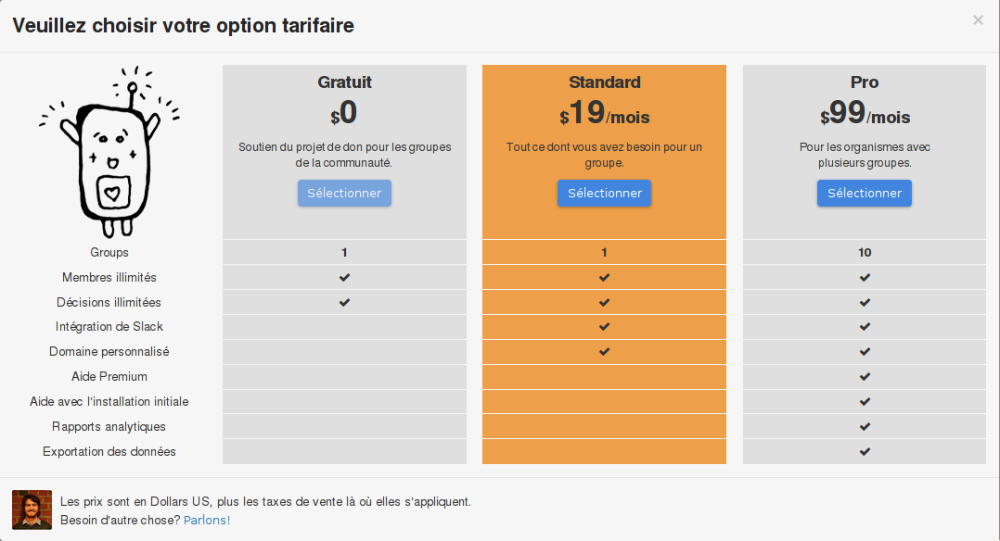

# Foire Aux Questions

## Notre groupe n‎‎’a pas (plus) de moyens financiers&nbsp;! Pouvons-nous toujours continuer à utiliser Diehard.Fund&nbsp;?

Oui. Vous pouvez opter pour un /forfait/programme donation (voir notre page [Tarification](http://loomio.org/pricing)).

## Nous n‎‎’avons pas encore décidé du forfait qui nous conviendrait, pouvons-nous prolonger la période d‎‎’essai gratuite&nbsp;?

Oui. Il suffit de faire la demande par courriel&nbsp;:  [contact@loomio.org](mailto:contact@loomio.org "opens in new tab"). Nous pouvons aussi vous conseillez sur la formule à choisir dans votre cas.

## How does the Free plan work?

The Free plan includes all the core functionality of Diehard.Fund, with unlimited users. Your members will be occasionally asked for a voluntary donation. Free plans do not include [Premium Features](https://loomio.gitbooks.io/manual/content/en/premium_features.html).

## How can we select a paid plan?

If you are in a Free plan and want to upgrade, select the blue Upgrade Plan button on your group's main page and choose one of our paid plans from the chart.

## Avez-vous des tarifs pour les souscriptions à l‎‎’année&nbsp;?

Oui. Notre offre standard est à 190 USD (Dollar US) par an, et l‎‎’offre Pro  est à 990 USD.

## Avec quelles cartes peut-on payer&nbsp;?

Visa, Mastercard et American Express.

## Êtes vous assujetti à la TVA&nbsp;?

Oui. En Nouvelle-Zélande, la TVA est ajoutée au prix de chaque souscription payante. Il n‎‎’y a pas de TVA sur les donations.

## Can I get an invoice?

Lors de votre première souscription vous recevrez un courriel de Chargify, notre système de paiement, avec pour objet **[Diehard.Fund] Manage Your Subscription**. Vous y trouverez un lien pour vous connecter à notre portail de facturation où vous pourrez télécharger vos relevés.
