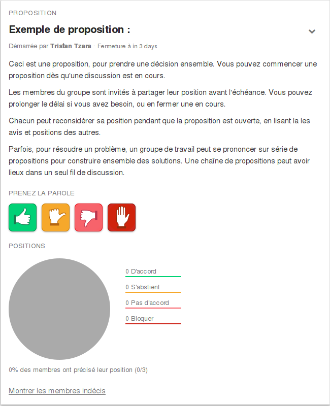

# Propositions

Les propositions prennent place dans un [fil de discussion](discussion_threads.html), qui englobe aussi bien la discussion que la proposition. Il ne peut y avoir qu‎‎’une proposition active à un moment donné dans un fil de discussion.

## Démarrer une proposition

Vous pouvez démarrer une proposition avec le bouton **Démarrer une proposition** sur la page du fil de discussion..

Lorsque vous démarrez une nouvelle proposition, il vous sera demander de donner un **Titre** bref, une **Date de fermeture** et tout **détails** pertinents. Utilisez les champs **Détails** pour donner toute information dont le groupe aurait besoin pour savoir exactement ce que signifie d‎‎’être d‎‎’accord (ou non) avec la proposition.

## Modifier une proposition

Seul l‎‎’auteur d‎‎’une proposition ou les coordinateurs du groupe peuvent modifier une proposition. Le **Titre** de la proposition ou les **détails** peuvent être modifiés jusqu‎‎’au premier membre participant. Néanmoins, la **date de fermeture** peut être modifiée à tout instant.

Pour modifier la proposition, sélectionnez l‎‎’option **Modifier la proposition** dans le menu déroulant des **Options de la proposition** dans la zone **Proposition**.

## Prendre position

Lorsque vous êtes prêt(e) à participer à une proposition, vous pouvez sélectionner un des quatre boutons de décision&nbsp;:

* **D‎‎’accord** signifie que vous êtes content de la proposition.

* **S‎‎’abstenir** signifie que vous laissez le groupe décider pour vous.

* **Pas d‎‎’accord** signifie que vous pensez qu‎‎’il y aurait de meilleures alternatives, mais vous vous plierez à la décision du groupe.

* **Bloquer** signifie que vous avez de fortes objections et que vous serez fortement mécontent si la proposition passe.

Lorsque vous avez choisi votre position, il vous sera demandé de donner une brève explication de la raison de ce choix.

En plus du graphique de la proposition, il y aura une liste contenant les noms, les positions et les raisons des membres qui ont voté à la proposition. Vous pourrez voir ce que tout le monde pense, et il sera facile de se retrouver dans le fil de discussion. Il y aura également un lien **Voir les membres indécis** qui affichera la liste de tous les membres n‎‎’ayant pas encore voté.

## Changer de position

Si vous souhaitez changer de position, vous pouvez le faire en cliquant sur le lien **Changez votre vote** près de votre position dans la zone **Proposition**.

## Définir le résultat de la proposition

Lorsque la proposition se termine, elle se réduit dans la zone **propositions précédentes**. Vous pouvez étendre la proposition en cliquant sur le lien **Étendre** dans la prévisualisation de la proposition.

Un champ modifiable de résultat apparaîtra sous les détails de la proposition, et la personne qui avait lancé la proposition sera prévenue par email d‎‎’expliciter le résultat de sa proposition. Les résultats de proposition peuvent être définis par la personne qui a démarré la proposition, ou par les coordinateurs du groupe. Lorsque le résultat de la proposition sera connu, tous les membres du groupe recevront un email les informant qu‎‎’il y a un résultat.

## Fermer une proposition

Seul le membre qui a démarré une proposition et les coordinateurs du groupe peuvent fermer une proposition active. Pour fermer une proposition, sélectionnez l‎‎’option **Fermer la proposition** dans le menu déroulant des options de la proposition.

## Propositions fermées / Décisions précédentes

Les propositions fermées sont réduites à la prévisualisation d‎‎’une proposition dans la zone **Propositions précédentes**. Vous pouvez étendre la proposition en cliquant sur le lien **Étendre** dans la prévisualisation de la proposition.
