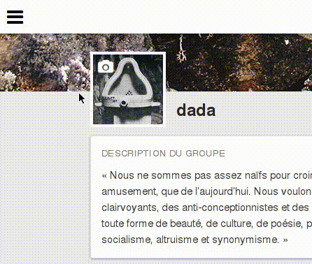

# Comprendre Loomio

You can access the most important parts of the Loomio app via the sidebar, the primary navigation menu which sits on the left-hand side of the page. The sidebar is open by default on large screens, and collapsed by default on small screens (such as smartphones). It can be toggled via the bars icon in the navigation bar.

## Naviguer dans vos fils de discussions

### Fils récents

**Fils récents** est la page d‎‎’accueil quand vous vous connectez à Loomio. Elle vous donne un aperçu des activités les plus récentes dans vos groupes. La page **Fils récents** affiche le contenu depuis vos groupes selon une liste priorisée. Les propositions ouvertes sont en haut, suivies par les fils de discussions **Favoris** (marqués d‎‎’une étoile), puis tous les autres fils de discussions de votre groupe, classées par activité la plus récente&nbsp;: **Aujourd‎‎’hui**, **Hier**, **Ce mois-ci**, **Plus d‎‎’un mois**.

Si un fil ou le titre d‎‎’une proposition est **en gras**, alors il y a eu de l‎‎’activité depuis votre dernière visite. Les nombres entre parenthèses après les titres indiquent combien de nouveaux commentaires ou votes ont été postés depuis votre dernière visite. Les propositions vont montrer un camembert, avec votre position en surimpression sur le diagramme. Si vous n‎‎’avez pas pris position, il y aura un point d‎‎’exclamation.

### Fils favoris

Cliquez sur l‎‎’icône étoile dans l‎‎’aperçu d‎‎’un fil pour ajouter ce fil aux **favoris**. Utilisez les étoiles pour distinguer les fils importants. Vous êtes la seule personne qui puisse voir si vous avez ajouté un fil à vos favoris.

### Fils non lus

Cette page montre tous les fils et propositions dans lesquels du contenu a été ajouté depuis votre dernière visite, classés par groupe. Vous pouvez cliquer sur **Marquer comme lu** sur l‎‎’aperçu d‎‎’un fil pour l‎‎’enlever de cette page sans aller voir le fil. Vous pouvez aussi [désactiver](keeping_up_to_date.html#thread-volume) les notifications d‎‎’un fil ici.

### Muted

The **Muted** page displays all threads you have previously muted. It can be accessed via the **Muted** option in the sidebar. Muted threads do not appear on your **Recent** or **Unread** pages.  You can mute a thread by hovering over the thread preview on the group page, **Recent Threads** page, or **Unread Threads** page, and selecting the **Mute** option.

### Filtrage des fils

Le menu déroulant **Filtres** vous permet de sélectionner ce que vous voyez&nbsp;:

* **Fils récents&nbsp;:** tous les fils et propositions avec de l‎‎’activité récente.

* **Fils contribués&nbsp;:** seulement les fils de discussion et propositions auxquels vous avez participé.

* **Silencieux&nbsp;:** seulement les fils dont vous avez [désactiver](keeping_up_to_date.html#thread-volume) les notifications.

## Viewing your groups

All the groups you belong to are listed in the sidebar. If you are only a member of one Loomio group, the home page for this group will be your landing page when you sign into Loomio. If you have multiple groups you can easily navigate between them from using the sidebar.

## Exploring public groups

You can explore, and request membership to, public Loomio groups by visiting the **Explore** page. The **Explore** page is accessed via the **Explore public groups** option in the sidebar.

## Editing your account information

You can view and update your user profile via the **Edit profile** option in the sidebar. You can read more about updating your user profile in the [User profile](your_user_profile.html "goes to user profile section of the help manual") section.

You can view and update the email settings associated with your Loomio account via the **Email settings** option in the sidebar. You can read more about updating your email settings in the [Keeping up to date](keeping_up_to_date.html "goes to keeping up to date section of the help manual") section.
