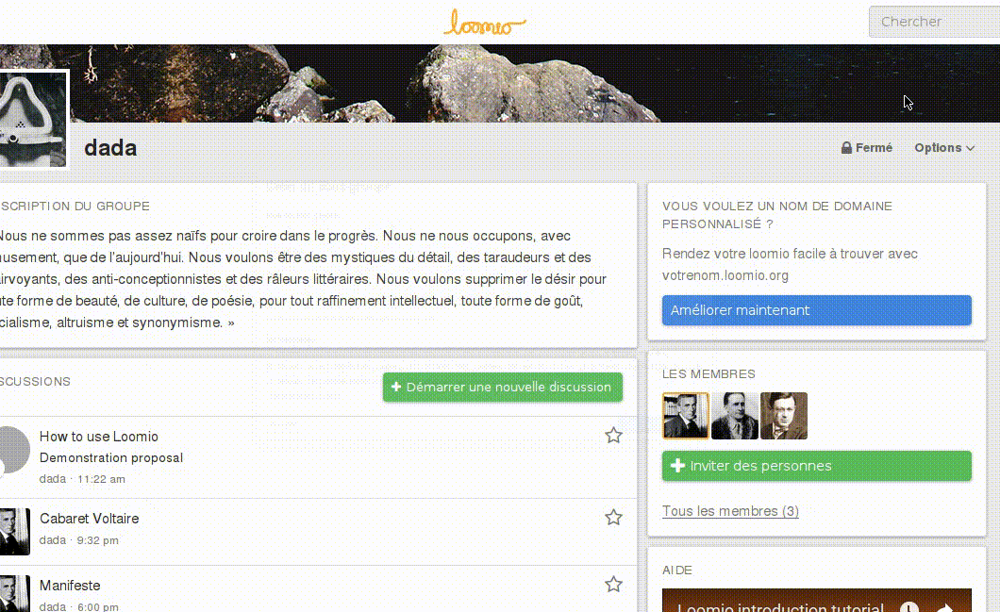

# Sous-groupes

Loomio vous offre la possibilité de créé des sous-groupes, au sein de vos groupes. Les sous-groupes permettent de diviser votre groupe en différentes équipes. Les sous-groupes Loomio peuvent accueillir, ou non, des membres du groupe parent ou non. Selon les paramètres du groupe [paramètres du groupe](group_settings.html), les sous-groupes peuvent être créés soit par n'importe quel membre du groupe, ou bien seulement par les coordinateurs.

Pour créer un sous-groupe, sélectionner **Ajouter un sous-groupe** dans le menu **Options** de la page de votre groupe.

## Visibilité du sous-groupe

To visit your subgroup settings page, click the **Options** button on the group page and select the **Edit Group Settings** option from the dropdown menu.

Subgroup settings are the same as [group settings](group_settings.html "goes to group settings section of the help manual"), but with additional privacy settings.

Dans la partie **Confidentialité**  de l'onglet **Modifier les paramètres du sous-groupe**, vous trouverez le champ **Qui peut trouver le groupe ?**,  qui établit si le sous-groupe est accessible aux membres du groupe parent. Quand l'option **personne dans [groupe parent]** est sélectionnée, le sous-groupe sera affiché dans la liste des **Sous-groupes** du groupe parent. Les membres du groupe parent pourront accéder à ce sous-groupe en explorant la page de sous-groupes.

Il existe aussi un autre paramètre de confidentialité lié aux discussions du sous-groupes. Le champ **qui peut voir les discussions** dans la partie **Confidentialité**, vous permet de choisir si les discussions sont accessibles pour les membres du groupe parent ou uniquement par les membres du sous-groupe. Si vous choisissez de rendre le sous-groupe accessible aux membres du groupe parent, tout en mettant les fils de discussion accessibles seulement aux membre du sous-groupes, alors les membres du groupe parent pourront accéder la page du sous-groupe mais pas aux fils de discussions.

Quand l'option **Personnes dans [groupe parent]** est désactivée, seuls les membres du sous-groupe pourront le trouver.
