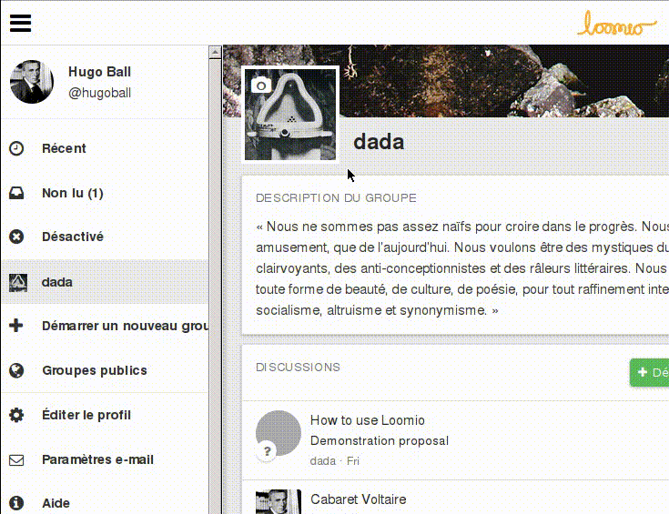
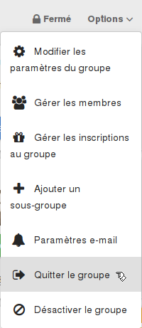

# Votre profil utilisateur

Votre page de profil vous permet de paramétrer votre identité Loomio. pour visiter votre page de profil, sélectionnez **Profil** dans le menu utilisateur dans la barre de navigation.

## Mettre à jour vos paramètres personnels
Vous pouvez mettre à jour le nom, le nom d'utilisateur, l' adresse de courriel et les paramètres de langue associés à votre compte en renseignant les champs correspondants sur votre page de profil, et en cliquant sur **Mettre à jour le profil**.

## Afficher une photo pour votre profil
Quand vous créez un compte Loomio, vos initiales vont être l'image par défaut associée à votre profil. Vous pouvez mettre en ligne une photo de profil en cliquant sur **Changer l'image** dans la partie **Image** de votre page de profil. Si vous avez un [Gravatar](https://fr.gravatar.com/), vous pouvez l'utiliser comme photo de profil en choisissant **Utiliser Gravatar**.

## Paramètres de langue
Loomio est accessible dans de nombreuses langues. Il va détecter automatiquement la langue de votre navigateur, mais vous pouvez choisir manuellement votre langue préférée en allant sur votre [page de profil](your_user_profile.html#your-user-profile) et en sélectionnant votre langue depuis le menu déroulant **Langue**.

## Nom d'utilisateur
Votre nom d'utilisateur est le nom que les autres participants vont utiliser pour vous mentionner ([@mention](comments.html#-mentioning-group-members)) dans les commentaires. Vous pouvez changer votre nom d'utilisateur en renseignant le champ **Nom d'utilisateur** sur votre [page de profil](your_user_profile.html#your-user-profile) et en cliquant sur **Mettre à jour le profil**.

## Changer votre mot de passe
Si vous êtes connecté à Loomio, vous pouvez changer votre mot de passe en allant sur votre page de profil et en cliquant sur **Changer votre mot de passe**. Si vous êtes déconnecté, vous pouvez aller sur la page [**Mot de passe oublié ?**](https://www.loomio.org/users/password/new "ouvre un nouvel onglet").

## Désactiver votre compte
Si vous n'êtes pas l'unique coordinateur d'un groupe vous pouvez désactiver votre compte en allant sur votre [page de profil](your_user_profile.html#your-user-profile) et en cliquant sur **Désactiver votre compte**. Si vous êtes le seul coordinateur d'un groupe, vous ne pourrez pas désactiver votre compte tant que vous n'aurez pas désigné un autre coordinateur de groupe, ou archivé le groupe.

Une fois que votre compte a été désactivé&nbsp;:

* vous ne serez plus listé comme membre d'un groupe
* les commentaires, propositions et discussions que vous avez faites resteront, mais votre nom sera supprimé
* vous ne recevrez plus de courriels concernant Loomio
* vous devrez [nous contacter](https://loomio.org/contact "ouvre un nouvel onglet") pour réactiver votre compte.

## Réactiver un compte
Pour réactiver un compte désactivé, [contactez nous](https://loomio.org/contact "ouvre un nouvel onglet").

## Quitter un groupe

Si vous n'êtes pas le seul coordinateur d'un groupe, vous pouvez quitter le groupe en sélectionnant **Quitter le groupe** depuis le menu Options sur la page du groupe. Si vous êtes le seul coordinateur de votre groupe, vous ne pourrez pas le quitter tant que vous n'aurez pas désigné un autre coordinateur ou désactivé le groupe.
