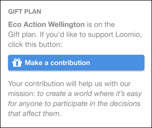

# Perguntas freqüentes sobre preços
 
## O nosso grupo não tem dinheiro! Ainda podemos usar o Diehard.Fund?
 
Sim. Você pode escolher o plano Presente (veja a nossa página de [Preço](http://loomio.org/pricing) ).
 
## Como funciona o plano Presente?
 
Se o seu grupo escolher o plano Presente, os seus membros vão ver um cartão como este em sua página de grupo:
 

 
## Vocês tem preços para assinaturas anuais?
 
Sim. Nosso plano padrão custa US$ 190 por um ano (uma economia de $38 sobre o preço da mensalidade), e o plano Plus é US$ 1.790 por ano (economia de $358).
 
## Posso estender meu período de teste?
 
Sim. Basta enviar um e-mail [contact@loomio.org](mailto:contact@loomio.org) e perguntar.
 
## Quais cartões de crédito vocês aceitam?
 
Visa e Mastercard. Estamos negociando com a American Express.
 
## Vocês estão registrados no GST?
 
Sim, estamos. Na Nova Zelândia o GST é adicionado ao preço para todas as assinaturas pagas. O GST não é adicionado às doações.
 
## Posso obter boletos?
 
Quando você configurar uma subscrição você receberá um e-mail da Chargify, nosso processador de pagamentos, com o assunto **[Diehard.Fund] Gerenciar Sua Assinatura**. Nele estará incluído um link para efetuar login no seu portal de faturamento, o que permitirá que você baixe faturas.
